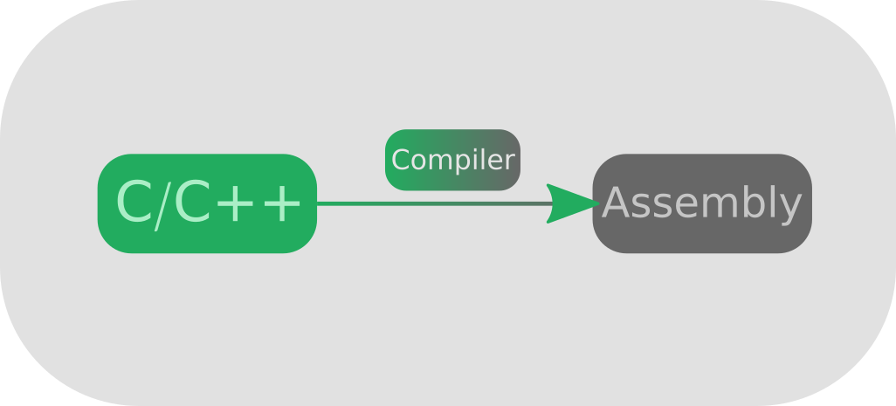
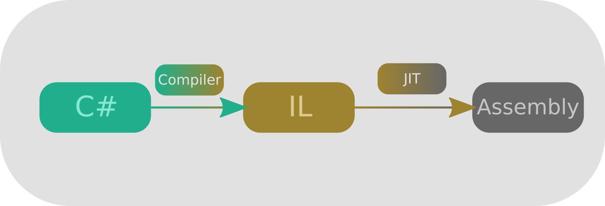

# The Transpilers Handbook

*By Locochoco / ShoosGun / Ivan Pancheniak*

*Version: 1.0.2*

*Date: 24/10/2022*

This is a handbook for people looking for examples and different ways to use the transpiler type of patching. Transpilers when compared to prefixes and postfixes are usually more complicated, as they have many moving parts, so if you still haven't learned them, I suggest you do it before you dip your toes on the transpiler waters.

In this text we will be using the HarmonyX tools and annotations, so be careful when copying the code if you are using plain Harmony. We will also be using dnSpy as a code decompiler, but any software that decompiles .Net code and allows you to view the C# code in IL should work too.

## What are transpilers and why?

If you played around with prefixes and postfixes in Harmony you might have noticed a few things: when you use them, you are redirecting the code so that yours runs either before or after it; and that you can choose to let the base code run. This options are great, but you can never actually change what happens inside of the method you are patching. 

It is for that purpose that transpilers exist! With them you can not only run what you want whenever you want, but also change the game code to make it do things that would not be possible with just prefixes and postfixes. 

Do you want an example? Let's suppose you have the following code:

```CSharp
void BananaCheck() //Code from Devs
{
    if(bananas >= 10)
    {
        ExplodePlayer();
    }
}
```
And that you don't want the player to explode at 10 `bananas` but at 11 `bananas`! With a postfix you can't do much, but with a prefix you *could* copy the method, run the edited version on the prefix and make it not run the original.

```CSharp
void BananaCheck() //Code from Devs
{
    if(bananas >= 10)
    {
        ExplodePlayer();
    }
}

bool PrefixBananaCheck() //Our Code
{
    if(bananas >= 11)
    {
        ExplodePlayer();
    }

    return false; //Skips the original
}
```

 Only issue, what if the developers of the code decide to add more stuff to that method, like add a method that must run otherwise the game breaks.

 ```CSharp
void BananaCheck() //Code from Devs
{
    if(bananas >= 10)
    {
        ExplodePlayer();
    }
    
    ReallyImportantMethodThatNeedsToRun();
}

bool PrefixBananaCheck() //Our Code
{
    if(bananas >= 11)
    {
        ExplodePlayer();
    }

    return false; //Tells harmony to not run the original.
}
```

Now not only is our prefix outdated, but it can make the game break as stuff that might be important inside `BananaCheck` isn't being run in our copy!

If our patching was a transpiler it wouldn't have this issue, as it would only edit the `10` to an `11`, and leave the rest intact, allowing the developer to make edits and change the order of stuff without actually breaking our mod.

Of course you can update your prefix and everything will return to normal, but I hope that this example can motivate you to learn the third type of patching: **Transpiler Patching!**

But before we can learn it there are a few things to clarify. Transpilers aren't as beginner friendly as prefixes and postfixes. Reason is, because we are now editing the game code, we need to work with a lower level language (thankfully not assembly), the Intermediary Lenguage, our next topic on this handbook. 

You don't need to worry about knowing how to write "Hello World" in IL nor how to compile C# code to IL in your head, but you will need to understand why changing the OpCodes (the building blocks of IL code) can result in what we want.

## Intermediary Language (IL)
You might have heard that if you code in C or C++, your code isn't run by the machine as is. It before needs to be compiled into Assembly code, which is the job of the compiler, who returns your `.exe` or `.dll` file that you can execute to run your program.



When you press the "build" button in your C# project something simmilar happens, a compiler compiles your code and in your "out" folder you now have a .exe or a .dll file. But these files are not the same as the ones from a C/C++ compiler, reason is, is that they are not in assemlby, but in **IL!**. When you run your executable, this new language is compiled into assembly during runtime by the **JIT**(**J**ust **I**n **T**ime) compiler. 



This is one of the reasons you must have a .Net version to run executables from .Net projects, and that executables from C/C++ run in *most* computers without any additional frameworks.

The face of IL is very simmilar to Assembly, although it has structures that resamble C# code. Its building blocks, as mentioned on the earlier part, is made by OpCodes.

 Because our focus is patching and not actually writing programs in IL, we will only see the OpCodes that are important for acomplishing the tasks of our transpiler, but if you want to learn more about IL you can check this [code project article.](https://www.codeproject.com/Articles/3778/Introduction-to-IL-Assembly-Language#Stack)

### OpCodes
---
OpCodes are the building blocks of IL. A good way to understand its relation to the source C# code is by looking at decompiled .Net code.

#### Basic structure
---
Let's take for example this "Hello World".
```CSharp
using System;

namespace TranspilerExamples
{
    internal class Program
    {
        static void Main(string[] args)
        {
            Console.WriteLine("Hello Transpiling!");
        }
    }
}
```
After its compilation in Debug mode, we can open the Main method in dnSpy in C# mode. It looks very simmilar to the original, doesn't it?
```CSharp
private static void Main(string[] args)
{
	Console.WriteLine("Hello Transpiling!");
}
```
Let's now change the code display mode from C# to IL, you will see something like this.
```CSharp
.method private hidebysig static 
	void Main (
		string[] args
	) cil managed 
{
	.maxstack 8
	.entrypoint
    IL_0000: nop
    IL_0001: ldstr     "Hello Transpiling!"
    IL_0006: call      void [mscorlib]System.Console::WriteLine(string)
    IL_000B: nop
    IL_000C: ret
}
```

Okay, now that is really different, but at the same time not that much. Let's take it all in steps.

First of all, we can see that the method headers are fairly simmilar, as they both contain the method name `Main`, they still keep its `private` and `static` protection, the `void` return type, and the arguments types with the same names.
```CSharp
private static void Main(string[] args)
{
```
```CSharp
.method private hidebysig static 
	void Main (
		string[] args
	) cil managed 
{
```

On the body of the method, for now, the only important part for us are the OpCodes, which are these:
```CSharp
nop
ldstr     "Hello Transpiling!"
call      void [mscorlib]System.Console::WriteLine(string)
nop
ret
```

The `nop` OpCodes, as their name _**N**o **Op**eration_ suggests, don't do anything. They appear on the debug version of the code to make debugging easier for the debugger, so we can ignore them, simplifing our code to this:
```CSharp
ldstr     "Hello Transpiling!"
call      void [mscorlib]System.Console::WriteLine(string)
ret
```

We now have 3 OpCodes, which are always executed from top to bottom. 

The first one, `ldstr`, means "Load String". Which string? Well the string that is on the same line as it, `"Hello Transpiling!`. 

`call` means "Call the method after me", the big name might look confusing, but it is the complete name of `Console.WriteLine()`. Our method call requires a string to run, so it will get the latest loaded string, which is `"Hello Transpiling!"` thanks to `ldstr`. 

After all this `ret` is called, which is the same as `return`, that means that once it gets called the method will stop running.

Can you see that it does exactly what we wrote in the C# code? All it does it run `Console.WriteLine()` (`call`) by before passing `"Hello Transpiling!"` (`ldstr`) as a parameter, and after that it stops the method from running (`ret`), which is the same as reaching the end of the method body in C#.

All IL code look like this, and differently from C# where all the information you need to know how a line of code runs is in that line of code, the Intermediary Language separates it in blocks which now require several lines of OpCodes.

#### OpCodes of interest
----
As mentioned before we will mostly be looking at the OpCodes which are interesting for patches, here is a table with them and what purpose they serve, we will shortly be looking at examples with them.

| OpCode| Syntax | Purpose |
|:--------------:|:-----:|:-----------:|
| `ldarg` | `ldarg` | Loads the argument passed to the method |
| `starg` | `starg` | Stores into the argument passed to the method |
| `ldloc` | `ldloc` | Loads local variable on the method |
| `stloc` | `stloc` | Stores into the local variable on the method |
| `ldc.i4` | `ldc.i4` | Loads a `int32` constant |
| `call` | `call [method complete name]`| Calls methods|
| `pop` | `pop` | Pops values from the [stack](#the-stack-nature-of-il)|
| `ret` | `ret`| Ends current method|
| `br` and simmilar | `br [Label to target OpCode]`| Jumps the code to the OpCode pointed by the label|


#### Some OpCodes to C# Examples
Here are some examples showing how each group of OpCodes results in the C# code we are used to.

##### 1) Calling static and non static methods

```CSharp
private void CallMethodsA(int[] array)
{
	int size = array.Length;
	Program.AddNumbers(10, (float)size);
	Console.WriteLine(array.Length);
	this.LoopFor(array);
	this.LoopWhile(array);
}
```

```CSharp
.method private hidebysig 
	instance void CallMethodsA (
		int32[] 'array'
	) cil managed 
{
	.maxstack 2
	.locals init (
		[0] int32 size
	)

	//int size = array.Length;
	IL_0000: ldarg.1//Gets the argument at position 1 (array)
	IL_0001: ldlen  //Gets the lenght of a vector
	IL_0002: conv.i4 //Converts long to int
	IL_0003: stloc.0 //Stores in the first local variable (size)
    
	//Program.AddNumbers(10, (float)size);
	IL_0004: ldc.i4.s  10 //Loads the value 10
	IL_0006: ldloc.0 //Loads the first local variable (size)
	IL_0007: conv.r4  //Converts size to a float
	IL_0008: call      float32 TranspilerExamples.Program::AddNumbers(int32, float32)
	IL_000D: pop //AddNumbers returns a value! but we don't want it, so we need to pop it out of the stack!
    
	//Console.WriteLine(array.Length);
	IL_000E: ldarg.1 //Loads the first argument (array)
	IL_000F: ldlen //Gets the lenght of a vector
	IL_0010: conv.i4 //Converts long to int
	IL_0011: call      void [mscorlib]System.Console::WriteLine(int32)
    
	//this.LoopFor(array);
	IL_0016: ldarg.0  //Notice that LoopFor is not a static method, which is way we first need to load "this"
	IL_0017: ldarg.1  //Loads the first argument (array)
	IL_0018: call      instance void TranspilerExamples.Program::LoopFor(int32[])
	
    //this.LoopFor(array);
	IL_001D: ldarg.0  //Notice that LoopWhile is not a static method, which is way we first need to load "this"
	IL_001E: ldarg.1  //Loads the first argument (array)
	IL_001F: call      instance void TranspilerExamples.Program::LoopWhile(int32[])
    
	/IL_0024: ret //Returns
}
```

Did you notice that the OpCodes are separated in blocks? This is because each block is equivalent to a line on the C# code, so try to go block by block seeing which is the equivalent C# line. 


##### 2) For Loop

```CSharp
private void LoopFor(int[] array)
{
	int size = array.Length;
	for (int i = 0; i < array.Length; i++)
	{
		size--;
	}
}
```

```CSharp
.method private hidebysig 
	instance void LoopFor (
		int32[] 'array'
	) cil managed 
{
	.maxstack 2
	.locals init (
		[0] int32 size,
		[1] int32 i
	)
    
	//int size = array.Length;
	IL_0000: ldarg.1 //Loads the first argument (array)
	IL_0001: ldlen //Gets the lenght of a vector
	IL_0002: conv.i4 //Converts long to int
	IL_0003: stloc.0 //Stores it in the first local variable (size)
    
	//int i = 0;
	IL_0004: ldc.i4.0 //Loads the constant 0
	IL_0005: stloc.1 //Stores in the second local variable (i)

	IL_0006: br.s      IL_0010 //Goes to IL_0010, where the for loop starts
	// start of loop 

		//size--;
		IL_0008: ldloc.0 //Gets size
		IL_0009: ldc.i4.1 //Gets constant 1
		IL_000A: sub //Substracts 1 from size
		IL_000B: stloc.0 //Stores result in size
	
		//i++
		IL_000C: ldloc.1 //Loads i
		IL_000D: ldc.i4.1 //Gets constant 1
		IL_000E: add //Adds 1 to i
		IL_000F: stloc.1 //Stores result in i
        
		//i < array.Length;
		IL_0010: ldloc.1 //Gets i
		IL_0011: ldarg.1 //Loads the first argument (array)
		IL_0012: ldlen //Gets the lenght of a vector
		IL_0013: conv.i4 //Converts long to int
		IL_0014: blt.s     IL_0008 //If i < the lenght of the vector, we go to IL_0008

	// end loop
    
	IL_0016: ret //Returns
} 
```

For more examples check the ones in the [dotnetperls website](https://www.dotnetperls.com/il).

### The Stack Nature of IL
---

As we saw before, the building blocks of IL are the OpCodes, so you might be asking, *"If the computer only sees the OpCodes line by line, how does it know what type of information I passed to, for example, a method?"*. The answer is that it also has a structure that holds what information is currently loaded, that structure being **a stack!**

You might have heard that a stack is a data structure where you can only insert (or *push*) data to its end (or top) and only remove (or *pop*) the last information stored. 

This means that an OpCode can either do nothing to the stack, *push* (*push* is the action of inserting values to its top) values to it, *pop* (*pop* is the action of getting the last value and removing it from the stack at the same time) values from it, or do both!

Remember when [it was said](#opcodes-of-interest) that the `ldarg` and `ldloc` OpCodes *"load"* stuff, for IL *loading* is *pushing information to the **stack***.

And `starg` or `stloc`, which *"store"* stuff, need *something* to be stored on the correct place, and that *something* is the value it gets when *poping* from the stack.

`call`s can do both, because they need to *pop* from the stack to pass the information to the method (if the method has arguments), and if they have a return value they **will** insert it to the stack.

Let's look at some examples:

#### Example 1)
```CSharp
//C# Code
private static void Main(string[] args)
{
	Console.WriteLine("Hello Transpiling!");
}
//IL code (Debug Mode)
.method private hidebysig static 
	void Main (
		string[] args
	) cil managed 
{
	.maxstack 8
	.entrypoint
    IL_0000: nop
    IL_0001: ldstr     "Hello Transpiling!"
    IL_0006: call      void [mscorlib]System.Console::WriteLine(string)
    IL_000B: nop
    IL_000C: ret
}
```

The stack is something shared through all the program, because this is our `Main` program, it starts empty:
| Stack |
|:-----:|
|   -   |

Line `IL_0000` does nothing to it, as it is a `nop` instruction. But line `IL_0001` does a `ldstr` which will *push* the string to the stack:
| Stack |
|:-----:|
|   `"Hello Transpiling!"`   |

Line `IL_006` does a `call` for `Console.WriteLine`, as the line suggests it requires a `string` and will return `void`. This means that it will *pop* the stack for the first value, which is the string it requires, but won't insert anything to it as, it *returns `void`*:
| Stack |
|:-----:|
|   -   |

Line `IL_000B` again does nothing, and `IL_000C` ends the method by returning to the caller, and because this the main method it will just exit the program.

#### Example 2)

```CSharp
//C# Code
static float Add(float a, float b)
{
    return  a + b;
}
//IL code (Release Mode)
.method private hidebysig static 
	float32 Add (
		float32 a,
		float32 b
	) cil managed 
{
	.maxstack 8

	IL_0000: ldarg.0
	IL_0001: ldarg.1
	IL_0002: add
	IL_0003: ret
}
```

Because `Add` is not the main method, there might already be stuff on the stack, which will be represented by *xxx*:
| Stack |
|:-----:|
|  xxx  |

Line `IL_0000` is a `ldarg.0`, so it will insert to the top the value at position `0` of the method arguments to the stack:
| Stack |
|:-----:|
|  `a`  |
|  xxx  |

Line `IL_0001` is also a `ldarg`, but for the one on position `1`, so the stack will look like:
| Stack |
|:-----:|
|  `b`  |
|  `a`  |
|  xxx  |

Now line `IL_0002` has `add`. This OpCode, as the [documentation says](https://learn.microsoft.com/pt-br/dotnet/api/system.reflection.emit.opcodes.add), pops two values from the stack, adds them together, and pushes the result back to the stack, this means that, step by step, the stack will look like:
| Stack (after `add` gets its *last* argument (we will see why it is the *last* on [example 4](#example-4))) |
|:-----:|
|  `a`  |
|  xxx  |

| Stack (after `add` gets its *first* argument) |
|:-----:|
|  xxx  |

| Stack (after `add` returns) |
|:-----:|
|  `a + b`  |
|  xxx  |

Then it returns at line `IL_0003`, as you can see, before the stack only had the *xxx* values, and now it also has `a + b`. This is how a call returns a value by pushing it to the stack, which lets the caller use it after.

#### Example 3)

```CSharp
//C# Code
private static void Main(string[] args)
{
	Console.WriteLine("Hello Transpiling!");
	Add(1f, 2f);
}
//IL code (Release Mode)
.method private hidebysig static 
	void Main (
		string[] args
	) cil managed 
{
	.maxstack 8
	.entrypoint

	IL_0000: ldstr     "Hello Transpiling!"
	IL_0005: call      void [mscorlib]System.Console::WriteLine(string)
	
	IL_000A: ldc.r4    1
	IL_000F: ldc.r4    2
	IL_0014: call      float32 TranspilerExamples.Program::Add(float32, float32)
	IL_0019: pop
	
	IL_001A: ret
}
```
Like on [example 1](#example-1), as this is our `Main` method the stack will start empty:
| Stack |
|:-----:|
|   -   |

Again, like on first example, lines `IL_0000` and `IL_0005` will push a `string` to the stack, and remove it when calling `Console.WriteLine`:
| Stack (after `IL_0000`) |
|:-----:|
|   `"Hello Transpiling!"`   |

| Stack (after `IL_0005`) |
|:-----:|
|   -   |

Lines `IL_000A` and `IL_000F`, `ldc.r4`, load `floats` into the stack, this means that after them the stack looks like:
| Stack (after `IL_000A`) |
|:-----:|
|  `1f` |

| Stack (after `IL_000F`) |
|:-----:|
|  `2f` |
|  `1f` |

`IL_0014` is the call of the method from [example 2](#example-2), so if we remember what it did on it, it will pop the two first values, and returns the sum of them:

| Stack (before `IL_0014` complets) |
|:-----:|
|   -   |

| Stack (after `IL_0014`) |
|:-----:|
|  `3f` |

Line `IL_0019` is a `pop`, this means that it will remove the first value on the stack. The reason why it is being used is because `Main` should return `void`, as that is the return type chosen for it, so we need the stack to be empty before calling `ret`:

| Stack (after `IL_0019`) |
|:-----:|
|   -   |


And as you might now know, `IL_001A` does a `ret`, exiting from the program (because this method is our *main* method).

#### Example 4)

```CSharp
//C# Code
static void Caller() 
{
    StringAdder(100, "love number! ", 2f);
}
//IL code (Release Mode)
.method private hidebysig static 
	void Caller () cil managed 
{
	.maxstack 8

	IL_0000: ldc.i4.s  100
	IL_0002: ldstr     "love number! "
	IL_0007: ldc.r4    2
	IL_000C: call      string TranspilerExamples.Program::StringAdder(int32, string, float32)
	IL_0011: pop
	
	IL_0012: ret
}
```

Like on [example 2](#example-2), we are going to assume that the stack already has values in it:
| Stack |
|:-----:|
|  xxx  |

As we saw before, lines `IL_0000`, `IL_0002` and `IL_0007` call OpCodes which will push (pushing is inserting but specifically to the start) the `100`, `"love number! "` and `2f` values to the stack:
| Stack (after `IL_0000`) |
|:-----:|
|  `100`  |
|  xxx  |

| Stack (after `IL_0002`) |
|:-----:|
|  `"love number! "`  |
|  `100`  |
|  xxx  |

| Stack (after `IL_0007`) |
|:-----:|
|  `2f`  |
|  `"love number! "`  |
|  `100`  |
|  xxx  |

Pay special atention to the order the pushing is made. Because the method called in `IL_000C` can only see values by poping from the stack one at the time, they need to be in a special order so it doesn't mix the order of the arguments. As we can see on the C# code, that order is `100`, `"love number! "` and `2f`. 

But, if we go from top to bottom (which is the way the method can access the values), the values are on the `2f`, `"love number! "` and `100` order. This means that the method receives the values on the ***reverse order!*** Or you can think that it gets the values from right to left from the method definition (`string TranspilerExamples.Program::StringAdder(int32, string, float32)`). So the stack will look like:

| Stack (before `IL_000C`) |
|:-----:|
|  `2f`  |
|  `"love number! "`  |
|  `100`  |
|  xxx  |

| Stack (after `IL_000C` get last argument) |
|:-----:|
|  `"love number! "`  |
|  `100`  |
|  xxx  |

| Stack (after `IL_000C` gets middle argument) |
|:-----:|
|  `100`  |
|  xxx  |

| Stack (after `IL_000C` gets first argument) |
|:-----:|
|  xxx  |

| Stack (after `IL_000C` returns) |
|:-----:|
|  `"love number! 1002"`  |
|  xxx  |

Simmilar to how we need to return an empty stack on [example 3](#example-3), `Caller()` has a return type of `void`, so we need to return the stack how it originally was, this means that we need to pop `"love number! 1002"` out of it with line `IL_0011`:

| Stack (after `IL_0011`) |
|:-----:|
|  xxx  |

Finally, `ret` is called in line `IL_0012` and the method returns control to whoever called it.


### Labels
---

Labels are a concept that exist in multiple programming languages. Basically what they do is mark a part of the code that you can later with a `goto` jump to. Of course that in regular programming they don't appear that much, but the concept in IL isn't that different. 

If you noticed on the examples, every OpCode has an index, the `IL_xxxx`, and because a line of code in IL is *just an OpCode*, a label, instead of just marking a line of code, points to an OpCode. For example, on the [For Loop](#2-for-loop) example, the code in `IL_0006` has as a parameter a label that points to the instruction at `IL_0010`.

### Branching
---

As you might have also noticed, there are no `if` or `for` OpCode, only the `br` OpCode, and from it several variants. They work in a simmilar way that a `goto` in other languages would (minus the controversy behind them), given a label, they will jump to it. But, differently from a regular `goto`, they can be conditional! A regular `br` is a "standart `goto`", but `blt` (**b**ranch if **l**ess **t**hen) only branches if the first argument passed to it (remember that the order that the OpCodes happen is the order of the arguments, so the first passed argument is the one at the top of the block) is less then the second. There are many OpCodes for branching, so here is a table of them:

| OpCode| Arguments | Simmilar to |
|:--------------:|:-----:|:-----------:|
| `br [LABEL]` | - | `goto [LABEL]` |
| `blt [LABEL]` | `number a, number b` | `if( a < b ) goto [LABEL]` |
| `ble [LABEL]` | `number a, number b`| `if( a <= b ) goto [LABEL]`|
| `bgt [LABEL]` | `number a, number b`| `if( a > b ) goto [LABEL]`|
| `bge [LABEL]` | `number a, number b`| `if( a >= b ) goto [LABEL]`|
| `beq [LABEL]` | `number a, number b`| `if( a == b ) goto [LABEL]`|
| `bne [LABEL]` | `number a, number b`| `if( a != b ) goto [LABEL]`|
| `brfalse [LABEL]` | `bool b`| `if( !b ) goto [LABEL]`|
| `brtrue [LABEL]` | `bool b`| `if( b ) goto [LABEL]`|

### Release vs Debug builds
---
Have you ever wondered what are the differences between a Release and a Debug build? You might already know that it does some optimizations to the `.dll` or `.exe`, sometimes even reduzing the size of the file. 

To do this the compiler might generate different groups of OpCodes for the same method! This means that a transpiler that worked on the release version may not work on the debug version, and vice versa. So when releasing your code, expect that someone might have to create a transpiler for your methods, so do not forget to build for Release when publishing and pay attention to not accidentally publish the Debug build.

### Extra information
---
These informations aren't that usefull for transpiling, but it can't hurt to know!

Have you notice that some OpCodes have a `.s` on the end? Like `blt.s` or `br.s`? They are short version of the `blt` and `br` Opcodes. The regular opcodes take as a label ints (int32). But usually you don't need to jump too much, as a for loop with a small body can appear several times in the code. So for small jumps we can use bytes (int8) to save space, and because an int is different from a byte, the `.s` is used to show that.

And what about the missing index on the example codes? On the [For Loop](#2-for-loop) example the `IL_0009` isn't there! Or is it?

```CSharp
	IL_0005: stloc.1 

	IL_0006: br.s      IL_0010 
		
	IL_0008: ldloc.0 
	IL_0009: ldc.i4.1 
```

In IL, everything needs to be in a new line, because, for the computer, all this is just a list of instructions, so how can we store information like the label that the branch needs to jump to? Easy, just store it with the rest of the code! This means that, if you could see the computer running that snipped of code, it would read the information about the label on the `IL_0009` index! Here are some other examples of storing non OpCode information in the indexes:

From the "Calling static and non static methods" example. `IL_0005` stores the `10` value, as it isn't stored like values from 0 to 9 in `ldc.i4.0` to `ldc.i4.9` , and because it is less then a *signed* byte capacity, `ldc.i4.s` is used.
```CSharp
	IL_0003: stloc.0 
    
	IL_0004: ldc.i4.s  10 
	IL_0006: ldloc.0
	IL_0007: conv.r4
```

From the "Hello World" example. `IL_0002` to `IL_0005` is skiped, I'm not sure what they hold, but probably the data needed to reconstruct the `"Hello Transpiling!"` string.
```CSharp
	IL_0001: ldstr     "Hello Transpiling!"
    IL_0006: call      void [mscorlib]System.Console::WriteLine(string)
```

This is the end of this somewhat introduction to IL and its OpCodes, if you want to learn more about them here are the sources mentioned on the text above, plus some others:

* [Codeproject article with a really in depth introduction to IL](https://www.codeproject.com/Articles/3778/Introduction-to-IL-Assembly-Language#Stack)

* [Dotnetperls website with IL code examples](https://www.dotnetperls.com/il)


* [Harmony docs transpiler guide](https://harmony.pardeike.net/articles/patching-transpiler.html)

* [OpCodes class from microsoft](https://learn.microsoft.com/en-us/dotnet/api/system.reflection.emit.opcode)
* [General information about CIL and IL from wikipedia](https://en.wikipedia.org/wiki/Common_Intermediate_Language)
* [A complete table of the OpCodes from wikipedia](https://en.wikipedia.org/wiki/List_of_CIL_instructions)

## CodeMatcher

Now that we have the knowledge of OpCodes and IL, we can finally do transpilers! To create them (using the HarmonyX annotation system) you need to do:

```CSharp
[HarmonyTranspiler]
[HarmonyPatch(/*The Params to patch your target method*/))]
static IEnumerable<CodeInstruction> Transpiler(IEnumerable<CodeInstruction> instructions)
{
	//Transpiler code
	//You need to return your edited instructions
}
```

As you might have noticed, transpilers always will have the `instructions` parameter. That parameter is the list of OpCodes from the target method, the same one that we saw on the previous section! Which means that editing that IEnumerable is actively changind the code, OpCode by OpCode.

There are several ways to edit the code. You can do the method from the [Harmony docs](https://harmony.pardeike.net/articles/patching-transpiler.html) where you use a `foreach` to search and edit the OpCodes. While that method does get the job done, it can make the loop get really big really quick. Another way, which is the one that will be teached here, is with the `CodeMatcher` class in Harmony/HarmonyX.

`CodeMatcher` works by first constructing a `CodeMatcher` by passing `instructions`. Then, with it, you can use its several helper functions to search, remove and add OpCodes to make the changes you want. And when you are done, just return the instructions by calling `.InstructionEnumeration()` on your `CodeMatcher` instance.
```CSharp
static IEnumerable<CodeInstruction> Transpiler(IEnumerable<CodeInstruction> instructions)
{
    CodeMatcher codeEditsHelper = new CodeMatcher(instructions);
	//Do stuff with codeEditsHelper
	return codeEditsHelper.InstructionEnumeration();
}
```
Most of the calls with `CodeMatcher` return itself, so you can even inline the method like this:
```CSharp
static IEnumerable<CodeInstruction> Transpiler(IEnumerable<CodeInstruction> instructions)
{
    return new CodeMatcher(instructions)
	//.FunctionA()
	//.FunctionB()
	//...
	.InstructionEnumeration();
}
```

`CodeMatcher` has an internal position pointer, this means that to modify code in a certain position of the `instructions` list, you will need to have called a method that moves said pointer to that position. We will shortly see that the methods we will mostly be using to move the pointer are `MatchForward` and `MatchBack` when the distance of the jump can vary, and `Advance` for general jumps. Other methods that have "AndAdvance" in the name like `InsertAndAdvance` and `SetOperandAndAdvance` will also make the pointer go to the next OpCode.

The HarmonyX docs have a [guide with CodeMatcher](https://github.com/BepInEx/HarmonyX/wiki/Transpiler-helpers) if you are interested.

### Transpiling mentality
---

One more thing before we start with `CodeMatcher`. To make transpilers it is good to have a small plan of action in your mind, this is the one I usually follow:

1) What do I want to change;
2) What steps I need to do with the OpCodes to achieve my change (steps like: "find [...], then change it to [...], and also remove [...]");

Let's see it in action. We have this modified example from the very beginning, where I want to change the values of every constant that has `10` to `11`.

```CSharp
public void BananaCheck() //Original
{
    if (bananas >= 10)
    {
        ExplodePlayer(10);
    }
    Console.WriteLine("I love my {0} bananas!", 10);

    int ten = 10;

    Console.WriteLine("This is a really cool number! {0}", ten + 1);
}
public void BananaCheck() //What I want
{
    if(bananas >= 11)
    {
        ExplodePlayer(11);
    }
	Console.WriteLine("I love my {0} bananas!", 11);
	
	int ten = 11;
	
    Console.WriteLine("This is a really cool number! {0}", ten + 1);
}
```

How do I achieve it? I need to somewhow replace what makes the `10`'s appear with `11`'s. By looking at the IL code of `BananaCheck()` we can see that the `10`'s come from the `ldc.i4.s  10` OpCode, so to do the change, we have to replace `ldc.i4.s  10` with `ldc.i4.s  11`.

```CSharp
.method public hidebysig 
	instance void BananaCheck () cil managed 
{
	.maxstack 3
	.locals init (
		[0] int32 ten
	)
	IL_0000: ldarg.0
	IL_0001: ldfld     int32 PlayerClass::bananas
	IL_0006: ldc.i4.s  10
	IL_0008: blt.s     IL_0012

	IL_000A: ldarg.0
	IL_000B: ldc.i4.s  10
	IL_000D: call      instance void PlayerClass::ExplodePlayer(int32)

	IL_0012: ldstr     "I love my {0} bananas!"
	IL_0017: ldc.i4.s  10
	IL_0019: box       [mscorlib]System.Int32
	IL_001E: call      void [mscorlib]System.Console::WriteLine(string, object)
	
	IL_0023: ldc.i4.s  10
	IL_0025: stloc.0
	
	IL_0026: ldstr     "This is a really cool number! {0}"
	IL_002B: ldloc.0
	IL_002C: ldc.i4.1
	IL_002D: add
	IL_002E: box       [mscorlib]System.Int32
	IL_0033: call      void [mscorlib]System.Console::WriteLine(string, object)
	
	IL_0038: ret
}
```
So the mental plan is:

1) I want to change `10`'s to `11`'s;
2) To do it I need to:
	* Find every `ldc.i4.s  10`
	* Replace them with `ldc.i4.s  11`.

From it we would now only have to implement the step 2 of the plan. We will shortly see that with `CodeMatcher` we could implement it like this:

```CSharp
static IEnumerable<CodeInstruction> Transpiler(IEnumerable<CodeInstruction> instructions)
{
    return new CodeMatcher(instructions)
	.MatchForward(false, //Searchs for everytime that the following "list" of codes is matched
            new CodeMatch(i => i.opcode == OpCodes.Ldc_I4_S && Convert.ToInt32(i.operand) == 10) 
			//^ Checks the Opcode to see if it is ldc.i4.s and holds the value 10
        ).Repeat(matcher => //For every match, execute this part
            matcher.RemoveInstruction()// Remove the original instruction
            .Insert(
                    new CodeInstruction(OpCodes.Ldc_I4_S, 11) //Insert ours in its place
        ))
	.InstructionEnumeration();
}
```

### Finding where the code is
---

An important part of transpiling is to find where the part of the code you want to modify is. Because the code is an unidimensional list of OpCodes, we can use simmilar techniques that you would use to find a substring in a string, or an element in an array.

A method you could use would be to use dnSpy to search for the index of the OpCodes that you want to change, and hardcode them in your transpiler. A problem with doing that is that (1) changes on the original code can make your transpiler no longer work and (2) it can make your transpiler incompatible with other transpilers.

To not need to know where the OpCodes are, but only how they "look" when grouped, we can use `CodeMatcher.MatchForward` and `CodeMatcher.MatchBack`.

| Method | Arguments | Description |
|:--------------:|:-----:|-----------|
| `MatchForward` | `bool useEnd, params CodeMatch[] matches` | `Matches forward and advances position. If useEnd is true it will set the position to the end of the match.` |
| `MatchBack` | `bool useEnd, params CodeMatch[] matches` | `Matches backwards and reverses position. If useEnd is true it will set the position to the end of the match.` |

You can think of them like matching for a substring in a string, but instead of searching for `"abc"` inside `"absdbaybbabsdhabcdbasabc"`, we are searching for a specific sequence of OpCodes. For example, let's say we want to find the `Console.WriteLine("Hello Transpiling!")` line from one of the very first examples.

```CSharp
private static void Main(string[] args)
{
	Console.WriteLine("Hello Transpiling!");
}
```
```CSharp
.method private hidebysig static 
	void Main (
		string[] args
	) cil managed 
{
	.maxstack 8
	.entrypoint
    IL_0000: nop
    IL_0001: ldstr     "Hello Transpiling!"
    IL_0006: call      void [mscorlib]System.Console::WriteLine(string)
    IL_000B: nop
    IL_000C: ret
}
```

We learned that `Console.WriteLine("Hello Transpiling!")` is represented by `ldstr "Hello Transpiling!"` and `call void [mscorlib]System.Console::WriteLine(string)`, so with `MatchFoward`, we could do:

```CSharp
static IEnumerable<CodeInstruction> Transpiler(IEnumerable<CodeInstruction> instructions)
{
    CodeMatcher matcher = new CodeMatcher(instructions)
	.MatchForward(false, //Notice how we are searching for any group that has a ldstr followed by a call!
            new CodeMatch(OpCodes.Ldstr),
			new CodeMatch(OpCodes.Call)
        );

	return matcher.InstructionEnumeration();
}
```

Notice that we need to pass the sequence of OpCodes with `CodeMatch`, this class can allow us to use lambda expressions for the comparison, which means that if we want to match only if `ldstr` holds `"Hello Transpiling!"`, we can do:

```CSharp
static IEnumerable<CodeInstruction> Transpiler(IEnumerable<CodeInstruction> instructions)
{
    CodeMatcher matcher = new CodeMatcher(instructions)
	.MatchForward(false, //Notice how we are searching for any group that
	                     //has a ldstr that holds "Hello Transpiling!" and is followed by a call!
            new CodeMatch(i => i.opcode == OpCodes.Ldstr && Convert.ToString(i.operand) == "Hello Transpiling!"),
			new CodeMatch(OpCodes.Call)
        );

	return matcher.InstructionEnumeration();
}
```

Not only this, but you can also match it to see if the operand is the same, so if we want to it to only match `ldstr` with `"Hello Transpiling!"` followed by `call` with `void [mscorlib]System.Console::WriteLine(string)`:

```CSharp
static IEnumerable<CodeInstruction> Transpiler(IEnumerable<CodeInstruction> instructions)
{
    CodeMatcher matcher = new CodeMatcher(instructions)
	.MatchForward(false, //Notice how we are now searching for any group that has
	//has a ldstr that holds "Hello Transpiling!" and is followed by a call for Console.WriteLine!
            new CodeMatch(i => i.opcode == OpCodes.Ldstr && Convert.ToString(i.operand) == "Hello Transpiling!"),
			new CodeMatch(OpCodes.Call, AccessTools.Method(typeof(Console), "Console.WriteLine", typeof(string)))
        );

	return matcher.InstructionEnumeration();
}
```

If we only want to match for the first (or last) group on the instruction, then just `MatchXXXX` is enough. But if you want to match for every group of OpCodes, we can call `Repeat`. `Repeat` allows us to execute code for every match, so if there were multiples `Console.WriteLine("Hello Transpiling!")`, we could do:

```CSharp
static IEnumerable<CodeInstruction> Transpiler(IEnumerable<CodeInstruction> instructions)
{
    CodeMatcher matcher = new CodeMatcher(instructions)
	.MatchForward(false, //Notice how we are now searching for any group that has
	//has a ldstr that holds "Hello Transpiling!" and is followed by a call for Console.WriteLine!
            new CodeMatch(i => i.opcode == OpCodes.Ldstr && Convert.ToString(i.operand) == "Hello Transpiling!"),
			new CodeMatch(OpCodes.Call, AccessTools.Method(typeof(Console), "Console.WriteLine", typeof(string)))
        ).Repeat(matcher =>
			//Matcher is a CodeMatcher with the index on the matched group, so inside this lambda expression we can
			//do actions that will happen to every match!
		);
		
	return matcher.InstructionEnumeration();
}
```

Making a parallel to the mental plan on the [Transpiling mentality](#transpiling-mentality) topic, `MatchXXXX` are the `Find xxxx` steps and `MatchXXXX` with `Repeat` are the `Find every xxxx`.

### Inserting, Removing and Modifying OpCodes
---

After having found the OpCodes, you will want to either insert new ones, remove existing ones or modify them.


#### Inserting
---

To insert new OpCodes we can use the `Insert` method. It will add a collection of `CodeInstruction` that you pass to it, pushing the instructions at the current position to after the ones you added. `CodeInstruction` hold the OpCode and the operand that it might have (operand is the extra value that the OpCodes might hold, as we saw with `call` or `ldstr` OpCodes). As mentioned before, because you need to use a method to move the pointer to the position you want to insert, your `Insert` call will usually follow, for example, a `MatchForward`.

```CSharp
static IEnumerable<CodeInstruction> Transpiler(IEnumerable<CodeInstruction> instructions)
{
    return new CodeMatcher(instructions)
	.MatchForward(false,
			//CodeMatch 1,
			//CodeMatch 2
        )
	.Insert(
		//CodeInstruction 1,
		//CodeInstruction 2,
		//CodeInstruction 3
		//...
	).InstructionEnumeration();
}
```

There is also `InsertAndAdvance`, which will advance the pointer to the position after the last added `CodeInstruction`.

```CSharp
static IEnumerable<CodeInstruction> Transpiler(IEnumerable<CodeInstruction> instructions)
{
    CodeMatcher matcher = new CodeMatcher(instructions)
	.MatchForward(false,
			//CodeMatch 1,
			//CodeMatch 2
        )
	.InsertAndAdvance(
		//CodeInstruction 1,
		//CodeInstruction 2,
		//CodeInstruction 3
		//...
	);
	
	return matcher.InstructionEnumeration();
}
```

And if we want to insert, for example, in the middle of the match, we can use the `Advance` method.

```CSharp
static IEnumerable<CodeInstruction> Transpiler(IEnumerable<CodeInstruction> instructions)
{
    CodeMatcher matcher = new CodeMatcher(instructions)
	.MatchForward(false,
			//CodeMatch 1,
			//CodeMatch 2
        )
	.Advance(1) //Considering that the match has 2 instructions, we advance 1 to be in the middle
	.InsertAndAdvance(
		//CodeInstruction 1,
		//CodeInstruction 2,
		//CodeInstruction 3
		//...
	);		
	return matcher.InstructionEnumeration();
}
```

Making again a parallel to the mental plan on [Transpiling mentality](#transpiling-mentality), `Insert` are the `Insert xxxx` steps.

#### Removing
---

Like inserting, removing is one of the basic operations. When compared to inserting they are much simpler, as they only require knowledge of the amount of instructions you want to remove, and if they are offseted to the current pointer position. Here is a table with the methods that do this operation:

| Method | Arguments | Description |
|:--------------:|:-----:|-----------|
| `RemoveInstruction` |  | Removes the instruction at the current position. |
| `RemoveInstructions` | `int count` | Removes the amount in `count` of instructions starting from the current poisition. |
| `RemoveInstructionsWithOffsets` | `int startOffset, int endOffset` | Removes the instructions starting inside the range in `startOffset` and `endOffset`, these positions are **relative**, which means **they are affected** by the position pointer position. |
| `RemoveInstructionsInRange` | `int start, int end` | Removes the instructions starting inside the range in `start` and `end`, these positions are **absolute**, which means **they aren't affected** by the position pointer position. |

Here is a simple example:

```CSharp
static IEnumerable<CodeInstruction> Transpiler(IEnumerable<CodeInstruction> instructions)
{
    CodeMatcher matcher = new CodeMatcher(instructions)
	.MatchForward(false,
			//CodeMatch 1,
			//CodeMatch 2
        )
	.RemoveInstructions(2); //Removes the two instructions we matched to
	return matcher.InstructionEnumeration();
}
```

In our the mental plan from [Transpiling mentality](#transpiling-mentality), `Remove` are the `Remove xxxx` steps, and if you combine them with `Insert` they become `Replace xxxx with xxxx`.

#### Modifying
---

Sometimes you don't need to remove nor insert new `CodeInstructions` to achieve what you want. If you only want to modify the operand of a OpCode or the OpCode itself we can call the `Set` methods. `SetOpcodeAndAdvance` only changes the OpCode type, while maitaining the operand it has, and `SetOperandAndAdvance` does the oposity. `Set` and `SetAndAdvance` change both the operand and the OpCode at the same time, and `SetInstruction` or `SetInstructionAndAdvance` does the same, given a `CodeInstruction`.


| Method | Arguments | Description |
|:--------------:|:-----:|-----------|
| `SetOpcodeAndAdvance` | `OpCode opcode` | Replaces OpCode type at current position and advances pointer. |
| `SetOperandAndAdvance` | `object operand` | Replaces operand of OpCode at current position and advances pointer. |
| `Set` | `OpCode opcode, object operand` |  Replaces operand and OpCode at current position. |
| `SetAndAdvance` | `OpCode opcode, object operand` | Replaces operand and OpCode at current position and advances pointer. |
| `SetInstruction` | `CodeInstruction instruction` | Replaces `CodeInstruction` at current position. |
| `SetInstructionAndAdvance` | `CodeInstruction instruction` | Replaces `CodeInstruction` at current position and advances pointer. |

An example:
```CSharp
static IEnumerable<CodeInstruction> Transpiler(IEnumerable<CodeInstruction> instructions)
{
    CodeMatcher matcher = new CodeMatcher(instructions)
	.MatchForward(false,
            new CodeMatch(i => i.opcode == OpCodes.Ldstr && Convert.ToString(i.operand) == "Hello Transpiling!"),
			new CodeMatch(OpCodes.Call, AccessTools.Method(typeof(Console), "Console.WriteLine", typeof(string)))
        ).Repeat(matcher =>
            matcher.SetOperandAndAdvance("Goodbye Transpiling!")
			//The pointer is currently on the position of the first matched OpCode, "ldstr".
			//So we can modify its operand changing the string it holds!
			//If we wanted we could change the method "call" calls by then doing a new 
			//matcher.SetOperandAndAdvance() with a method pointer as the operand.
		);
	return matcher.InstructionEnumeration();
}
```
This is the proper way to do the `Replace xxxx with xxxx` step from our [mental plan](#Transpiling-mentality).

### Loading and Storing variables
#### Local variables
---
Now that we saw how to insert new `CodeInstructions` you might be asking what can we add with them. 

The first thing that might come to mind are the local variables in a method. They are stored in the local variables stack, which means we can acess them with the `ldloc` and change them with `stloc`.

The reason why this is interesting is that you can't acess that type of information regularly, as it only exists while the method is running.

Let's look at an example:

Imagine that we want to change `ten` from 10 to 11, but only **after** ten is used in that `Console.WriteLine("This is a really cool number! {0}", ten + 1)` and before `Console.WriteLine("Good thing that ten is still {0}", ten)`.
```CSharp
public void BananaCheck() //Original
{
    if (bananas >= 10)
    {
        ExplodePlayer(10);
    }
    Console.WriteLine("I love my {0} bananas!", 10);

    int ten = 10;

    Console.WriteLine("This is a really cool number! {0}", ten + 1);
	
    Console.WriteLine("Good thing that ten is still {0}", ten);
}

public void BananaCheck() //What we want
{
    if (bananas >= 10)
    {
        ExplodePlayer(10);
    }

    Console.WriteLine("I love my {0} bananas!", 10);

    int ten = 10;

    Console.WriteLine("This is a really cool number! {0}", ten + 1);

	ten = 11;

    Console.WriteLine("Good thing that ten is still {0}", ten);
}

//IL code from the original BananaCheck()
.method public hidebysig 
instance void BananaCheck () cil managed 
{
.maxstack 3
.locals init (
	[0] int32 ten
)
IL_0000: ldarg.0
IL_0001: ldfld     int32 PlayerClass::bananas
IL_0006: ldc.i4.s  10
IL_0008: blt.s     IL_0012

IL_000A: ldarg.0
IL_000B: ldc.i4.s  10
IL_000D: call      instance void PlayerClass::ExplodePlayer(int32)
	
IL_0012: ldstr     "I love my {0} bananas!"
IL_0017: ldc.i4.s  10
IL_0019: box       [mscorlib]System.Int32
IL_001E: call      void [mscorlib]System.Console::WriteLine(string, object)
	
IL_0023: ldc.i4.s  10
IL_0025: stloc.0
	
IL_0026: ldstr     "This is a really cool number! {0}"
IL_002B: ldloc.0
IL_002C: ldc.i4.1
IL_002D: add
IL_002E: box       [mscorlib]System.Int32
IL_0033: call      void [mscorlib]System.Console::WriteLine(string, object)
	
IL_0045: ldstr     "Good thing that ten is still {0}"
IL_004A: ldloc.0
IL_004B: box       [mscorlib]System.Int32
IL_0050: call      void [mscorlib]System.Console::WriteLine(string, object)
	
IL_0056: ret
}
```

Looking at the IL code we can see that our mental plan is:

1) I want to insert `ten = 11` before `Console.WriteLine("Good thing that ten is still {0}", ten)`
2) To do it I need to:
	* Find `Console.WriteLine("Good thing that ten is still {0}", ten)`
		* `ldstr "Good thing that ten is still {0}"`
		* `ldloc.0`
		* `box`
		* `call void [mscorlib]System.Console::WriteLine(string, object)`
	* Insert `ten = 11` at the found position
		* `ldc.i4.s 11` (As we saw before this loads 11)
		* `stloc.0` (This will store the value we loaded to the local variable at the 0 position, which is `ten`)

Which results in the following transpiler code:

```CSharp
static IEnumerable<CodeInstruction> Transpiler(IEnumerable<CodeInstruction> instructions)
{
	return new CodeMatcher(instructions)
    .MatchForward(false,
            new CodeMatch(i => i.opcode == OpCodes.Ldstr && Convert.ToString(i.operand) == "Good thing that ten is still {0}"),
            new CodeMatch(OpCodes.Ldloc_0),
            new CodeMatch(OpCodes.Box),
            new CodeMatch(OpCodes.Call, AccessTools.Method(typeof(Console), "Console.WriteLine", new Type[] { typeof(string), typeof(object) }))
        ).Insert(
            new CodeInstruction(OpCodes.Ldc_I4_S, 11),
            new CodeInstruction(OpCodes.Stloc_0)
        )       
    .InstructionEnumeration();
}
```

#### Field Variables and Method Arguments
---
One other interesting thing we can do is store and load variables to the fields of the class instance or the arguments passed to the method we are transpiling. This isn't as usefull as you can usually already access them with publicized assemblies or the `AccessTools` class.

Loading and storing to method arguments can be achieved with `ldarg` and `starg` (always remember that for non static methods, `ldarg.0` is the `this` object) and doing the same things we did with the local variables on the previous section. But to store and load fields we have some helper methods in `CodeInstruction`. They are `CodeInstruction.LoadField` and `CodeInstruction.StoreField`, which after passing its parameters will return a `CodeInstruction` ready to be used.

Here is a simple example:

We want to change the class field `bananas` from `10` to `100` in the middle of the call of the `Console.WriteLine`'s.

```CSharp
/// ----- Class code -----
int bananas = 10;

public void BanananaB() //Original Method
{
    Console.WriteLine("You have {0} bananas", bananas);
    Console.WriteLine("You still have {0} bananas", bananas);
}

/// ---------------------

public void BanananaB() //Method we want
{
    Console.WriteLine("You have {0} bananas", bananas);
	bananas = 100;
    Console.WriteLine("You still have {0} bananas", bananas);
}

//IL code from Original BanananaB()
.method public hidebysig 
	instance void BanananaB () cil managed 
{
	.maxstack 8
	IL_0001: ldstr     "You have {0} bananas"
	IL_0006: ldarg.0
	IL_0007: ldfld     int32 PlayerClass::bananas
	IL_000C: box       [mscorlib]System.Int32
	IL_0011: call      void [mscorlib]System.Console::WriteLine(string, object)

	IL_0017: ldstr     "You still have {0} bananas"
	IL_001C: ldarg.0
	IL_001D: ldfld     int32 PlayerClass::bananas
	IL_0022: box       [mscorlib]System.Int32
	IL_0027: call      void [mscorlib]System.Console::WriteLine(string, object)

	IL_002D: ret
}
```
Or mental project is then:

1) I want to insert `bananas = 11` after `Console.WriteLine("You have {0} bananas", bananas)`
2) To do it I need to:
	* Find `Console.WriteLine("You have {0} bananas", bananas)`
		* `ldstr "You have {0} bananas"`
		* `ldarg.0`
		* `ldfld int32 PlayerClass::bananas`
		* `box`
		* `call void [mscorlib]System.Console::WriteLine(string, object)`
	* Insert `ten = 11` at the found position
		* `ldarg.0` (You always first have to push the "this" to store or load things from the class instance the method is in)
		* `ldc.i4.s 100`
		* A way to call `stfld int32 PlayerClass::bananas`

To create the `stfld` for `bananas` we will use `CodeInstruction.StoreField(typeof(PlayerClass), "bananas")`, which will handle all the acessing for us. So our transpiler will look like:

```CSharp
static IEnumerable<CodeInstruction> Transpiler(IEnumerable<CodeInstruction> instructions)
{
    return new CodeMatcher(instructions)
    .MatchForward(true, //We want to match the first Console.WriteLine, and then go to the end of the match,
						//so notice that we are passing "true" instead of "false"
            new CodeMatch(i => i.opcode == OpCodes.Ldstr && Convert.ToString(i.operand) == "You have {0} bananas"),
            new CodeMatch(OpCodes.Ldarg_0), //Just like when storing, you need to call "this" to load a field
            new CodeMatch(i => i.opcode == OpCodes.Ldfld && ((FieldInfo)i.operand).Name == "bananas"),
            new CodeMatch(OpCodes.Box),
            new CodeMatch(OpCodes.Call, AccessTools.Method(typeof(Console), "Console.WriteLine", new Type[] { typeof(string), typeof(object) }))
        )//MatchForward matches to the end of the range, so we need to advance one to insert right after the Console.WriteLine
        .Advance(1)
        .Insert(
            new CodeMatch(OpCodes.Ldarg_0), //Always remember to call "this", as it will be the first argument in most instance related calls
            new CodeInstruction(OpCodes.Ldc_I4_S, 100),
            CodeInstruction.StoreField(typeof(PlayerClass), "bananas")
        )       
    .InstructionEnumeration();
}
```

`CodeInstruction.LoadField` works in a simmilar manner, so when you want to use them you only need the class type, the field name and not forget to call `ldarg.0` or the class instance pointer (all this examples use the `this` class instance, but this work for any class instance inside the method, just change `ldarg.0` to what loads the instance).

### Calling functions
---

Calling a function is one of the most powerfull things you can do with a transpiler. If you are having problems creating a `ldstr` to load a string into another method or something else, you can usually make a method which will return the value for you, saving time you would "waste" figuring out what is wrong with your IL code. And to help with that we have two helper methods (which in the end are the same method with different names)!

Let's start with the casual way of calling a method. You can do that with `CodeInstruction.Call`, passing the class type and method name, just like how we did with class fields. Here is a simple code snippet of a transpiler:

```CSharp
.Insert(
	new CodeMatch(OpCodes.Ldarg_0), //Always remember to call "this", even if the method has no apparent argument, if it isn't static, it will have "this" as a parameter.
    CodeInstruction.Call(typeof(PlayerClass), "BananaCheck")
)
```

Now with `CodeInstruction.CallClosure` or `Transpiler.EmitDelegate`, we can call delegates! This is usefull because if you have a complex logic which only needs to be in a position inside the method body, and doesn't branch to other parts of the main IL code, you can place that inside a delegate function, and pass said function to one of the two helper classes.

If it is a method that doesn't return, you need to specify that it is an `Action`, see the following examples:

```CSharp
.Insert(
    CodeInstruction.CallClosure<Action>(() => //This has no parameters value, so you have to pass a simple <Action> to it 
    {
        Console.WriteLine("AAAH STOP WITH THESE BANANAS EXAMPLES!!!1!!11!");
    })
)
```
```CSharp
.Insert(
    new CodeMatch(OpCodes.Ldarg_0),
    CodeInstruction.LoadField(typeof(PlayerClass), "bananas"),
    Transpiler.EmitDelegate<Action<int>>((bananas) =>  //Transpiler.EmitDelegate and CodeInstruction.CallClosure are interchangeable
	//Because this action has a int as a parameter, we need to pass a int to it, in this case the "bananas" field from the class instance
   	{
    	if(bananas > 1000)
        {
        	Console.WriteLine("Make it stop");
        }
    })
)
```

And if it does return a value, you need to pass it as a `Func`:

```CSharp
.Insert(
    CodeInstruction.CallClosure<Func<string>>(() => //This has no parameters value, so you have to pass a simple <Action> to it 
    {
        return "bananas";
    })
)
```
```CSharp
.Insert(
    new CodeMatch(OpCodes.Ldarg_0),
    CodeInstruction.LoadField(typeof(PlayerClass), "bananas"),
    Transpiler.EmitDelegate<Func<string, int>>((bananas) =>
   	{
		 return bananas.ToString() + " bananas";
    })
)
```

### Creating branches
---
As we saw before when learning about IL, branches are what make if/else and loops work. 

Like how the branching OpCode stores that label value, we will also need to create a label to point to the desired OpCode with `CreateLabel`, and then pass it as the parameter of our OpCode.

Let's look at this example. We want to add this if statement where it will not allow `Console.WriteLine("Booom! {0}", i)` to run unless `i < 10` is true.

```CSharp
void ExplodePlayer(int i) //Original
{
    Console.WriteLine("Booom! {0}", i);
}

void ExplodePlayer(int i) //What we want
{
	if(i < 10)
	{
    	Console.WriteLine("Booom! {0}", i);
	}
}
.method private hidebysig 
	instance void ExplodePlayer (
		int32 i
	) cil managed 
{
	.maxstack 8
	IL_0001: ldstr     "Booom! {0}"
	IL_0006: ldarg.1
	IL_0007: box       [mscorlib]System.Int32
	IL_000C: call      void [mscorlib]System.Console::WriteLine(string, object)
	
	IL_0012: ret
} 
```

So our plan is:

1) I want `Console.WriteLine("Booom! {0}", i)` to be skiped when `i >= 10`
2) To do it I need to:
	* Find `Console.WriteLine("Booom! {0}", i)`
		* `ldstr "Booom! {0}"`
		* `ldarg.1`
		* `box`
		* `call void [mscorlib]System.Console::WriteLine(string, object)`
	* Insert a branching OpCode which points to an OpCode after the `call` OpCode, which will **skip** when when `i >= 10`
		* `ldarg.1`
		* `ldci4.s 10`
		* `bge [Label to after call]` (Remember, this will not branch if the value in the first loaded OpCode is **less then the second**, which is the desired if statement)

Which can be turned to the following transpiler:

```CSharp
static IEnumerable<CodeInstruction> Transpiler(IEnumerable<CodeInstruction> instructions, ILGenerator generator)
{
   return new CodeMatcher(instructions, generator)
   .MatchForward(false,
               new CodeMatch(i => i.opcode == OpCodes.Ldstr && Convert.ToString(i.operand) == "Booom! {0}"),
               new CodeMatch(OpCodes.Ldarg_1),
               new CodeMatch(OpCodes.Box),
               new CodeMatch(OpCodes.Call, AccessTools.Method(typeof(Console), "Console.WriteLine", new Type[] { typeof(string), typeof(object) }))
           )
           .CreateLabelWithOffsets(4, out Label labelToAfterConsoleWriteLine) //Creates a label to the OpCode right after Console.WriteLine            
           .InsertAndAdvance(
               new CodeInstruction(OpCodes.Ldarg_1), //i
               new CodeInstruction(OpCodes.Ldc_I4_S, 10), //10
               new CodeInstruction(OpCodes.Bge, labelToAfterConsoleWriteLine) // if i < 10, it won't skip the Console.WriteLine
           )
       .InstructionEnumeration();
}
```

Notice that we now need to add `ILGenerator generator` to our transpiler arguments and then pass it to the constructor of `CodeMatcher`. This is needed to able to create labels.

As you can notice from the example above, you need the position of the OpCode you want to create a label to. If you want to point to an OpCode that is somewhere far away from where you are going to insert you code, you will need to first do a `MatchXXXX` to find where that OpCode is, create a label to it, and then search for the place you will be modyfing the instructions.

That example, again, shows the general way to use `blt`, `ble`, `bgt`, `bge`, `beq` and `bne`, which can compare floats and ints, and if you don't remember what which means here is the table for them from the [Branching](#branching) section.

| OpCode| Arguments | Simmilar to |
|:--------------:|:-----:|:-----------:|
| `blt [LABEL]` | `number a, number b` | `if( a < b ) goto [LABEL]` |
| `ble [LABEL]` | `number a, number b`| `if( a <= b ) goto [LABEL]`|
| `bgt [LABEL]` | `number a, number b`| `if( a > b ) goto [LABEL]`|
| `bge [LABEL]` | `number a, number b`| `if( a >= b ) goto [LABEL]`|
| `beq [LABEL]` | `number a, number b`| `if( a == b ) goto [LABEL]`|
| `bne [LABEL]` | `number a, number b`| `if( a != b ) goto [LABEL]`|

But there are also `br`, `brtrue` and `brfalse`. `br` will always skip, so you only need to worry about giving it the label. `brtrue` and `brfalse` on the other hand require only one argument, which is a bool. That bool is usually the result of a `call` OpCode, here is the same code as before but using the `brtrue` OpCode and the needed changes:

```CSharp
static IEnumerable<CodeInstruction> Transpiler(IEnumerable<CodeInstruction> instructions, ILGenerator generator)
{
    return new CodeMatcher(instructions, generator)
    .MatchForward(false,
            new CodeMatch(i => i.opcode == OpCodes.Ldstr && Convert.ToString(i.operand) == "Booom! {0}"),
            new CodeMatch(OpCodes.Ldarg_1),
            new CodeMatch(OpCodes.Box),
            new CodeMatch(OpCodes.Call, AccessTools.Method(typeof(Console), "Console.WriteLine", new Type[] { typeof(string), typeof(object) }))
        )
        .CreateLabelWithOffsets(4, out Label labelToAfterConsoleWriteLine) //Creates a label to the OpCode right after Console.WriteLine            
        .InsertAndAdvance(
            new CodeInstruction(OpCodes.Ldarg_1),
            CodeInstruction.CallClosure<Func<int, bool>>((i) => //Now this function is where the conditional operation happens
            { 
                return i >= 10; 
            }),
            new CodeInstruction(OpCodes.Brtrue, labelToAfterConsoleWriteLine) // if what is returned is false, it won't skip the Console.WriteLine
        )
    .InstructionEnumeration();
}
```

Using `brtrue` or `brfalse` can give you more options, allow better dubugging and can make changing stuff easier, so I really recommend them unless the branch really only depends on the relation of two numbers.

##### Breaking from loops
---
Let's say that we have the following code, and we want to break the loop when `number == 500`.
```CSharp
public void LoopingLoop() //Original
{
    int number = 0;
    for(int i = 0; i <= 1000; i++) 
    {
        number = i;
    }
    if(number == 1000)
    {
        Console.WriteLine("The loop passed through all the values");
    }
}

public void LoopingLoop() //Goal
{
    int number = 0;
    for(int i = 0; i <= 1000; i++) 
    {
        number = i;
		if(number == 500)
		{
			break;
		}
    }
    if(number == 1000)
    {
        Console.WriteLine("The loop passed through all the values");
    }
}

.method public hidebysig  //IL Code from LoopingLoop()
	instance void LoopingLoop () cil managed 
{
	.maxstack 2
	.locals init (
		[0] int32 number,
		[1] int32 i,
		[2] bool,
		[3] bool
	)

	IL_0001: ldc.i4.0
	IL_0002: stloc.0
	
	IL_0003: ldc.i4.0
	IL_0004: stloc.1
	
	IL_0005: br.s      IL_000F
	// loop start	
		IL_0008: ldloc.1
		IL_0009: stloc.0
		
		IL_000B: ldloc.1
		IL_000C: ldc.i4.1
		IL_000D: add
		IL_000E: stloc.1
		
		IL_000F: ldloc.1
		IL_0010: ldc.i4    1000
		IL_0015: cgt
		IL_0017: ldc.i4.0
		IL_0018: ceq
		IL_001A: stloc.2
		
		IL_001B: ldloc.2
		IL_001C: brtrue.s  IL_0007
	// end loop
	
	IL_001E: ldloc.0
	IL_001F: ldc.i4    1000
	IL_0024: ceq
	IL_0026: stloc.3

	IL_0027: ldloc.3
	IL_0028: brfalse.s IL_0037	

	IL_002B: ldstr     "The loop passed through all the values"
	IL_0030: call      void [mscorlib]System.Console::WriteLine(string)

	IL_0037: ret
}
```

First we need to find where the body of the loop (`number = i`) is. We can observe that `number` is the local variable of index 0, and that it stores the value of `i`, which is of index 1, so `number = i` must happen when you first call `ldloc.1` and then `stloc.0`, which are the instructions in `IL_0008` and `IL_0009`.

Now that we found the body of the loop, we need to figure out where does it end, the comment on the IL code helps us by telling that after `brtrue.s` there is no longer a loop (that comment is generated by dnSpy), so when breaking, we need to jump to the instruction after that `brtrue.s`.

Having these informations we can finally develop our project:

1) I want to break from the loop when `number == 500`
2) To do this I need to:
	* Find the end of the loop and create a label out of it (we will call it `labelToOutOfLoop`)
		* `ldloc.2`
		* `brtrue.s`
	* Find `number = i`
		* `ldloc.1`
		* `stloc.0`
	* Insert a branch which will jump to `labelToOutOfLoop` when `number == 500`
		* `ldloc.0`
		* `call` to a Func which will make the `number == 500` comparison
		* `brtrue [labelToOutOfLoop]`

Which results in the code:
```CSharp
static IEnumerable<CodeInstruction> Transpiler(IEnumerable<CodeInstruction> instructions, ILGenerator generator)
{
    return new CodeMatcher(instructions, generator)
    .MatchForward(false,
            new CodeMatch(OpCodes.Ldloc_2),
            new CodeMatch(OpCodes.Brtrue)
        )
    .CreateLabelWithOffsets(2, out Label labelToOutOfLoop) //Creates a label which exits the loop
    .Start()  //We had to pass our code to create the label, so we need to start the match from the start
    .MatchForward(true,
            new CodeMatch(OpCodes.Ldloc_1),
            new CodeMatch(OpCodes.Stloc_0)
        )
        .Advance(1) //Advance to after "number = i"
        .InsertAndAdvance(
            new CodeInstruction(OpCodes.Ldloc_1),
            CodeInstruction.CallClosure<Func<int, bool>>((number) =>
            {
                return number == 500;
            }),
            new CodeInstruction(OpCodes.Brtrue, labelToOutOfLoop) //Breaks from loop if number == 500
        )
     .InstructionEnumeration();
}
```

So to break from loops of most kinds, we first need to figure out where do they end so we can create a label to jump there, and then where is the loop body to allow us to add our loop break inside of it.

### Returning earlier
---

Returning earlier is one of the easiest things to do, as there is already an OpCode which does that for you, `ret`. The only thing it asks is for a value to be loaded on the stack if the method has to return something.

Imagine a situation where you have this method, and you want to return the value of `101` if `ball == "not ball"`, and have this check after `string ball = IsBall()`.

```CSharp
public int Balling() //Original Method
{
    string ball = IsBall();
    int lenght = ball.Length;
    lenght += ball[0];
    return lenght;
}

public int Balling() //Desired Method
{
    string ball = IsBall();

	if(ball == "not ball")
	{
		return 101;
	}

    int lenght = ball.Length;
    lenght += ball[0];
    return lenght;
}

.method public hidebysig 
	instance int32 Balling () cil managed  //IL code from Balling()
{
	.maxstack 3
	.locals init (
		[0] string ball,
		[1] int32 lenght,
		[2] int32
	)
	IL_0001: ldarg.0
	IL_0002: call      instance string PlayerClass::IsBall()
	IL_0007: stloc.0
	
	IL_0008: ldloc.0
	IL_0009: callvirt  instance int32 [mscorlib]System.String::get_Length()
	IL_000E: stloc.1
	
	IL_000F: ldloc.1
	IL_0010: ldloc.0
	IL_0011: ldc.i4.0
	IL_0012: callvirt  instance char [mscorlib]System.String::get_Chars(int32)
	IL_0017: add
	IL_0018: stloc.1
	
	IL_0019: ldloc.1
	IL_001A: stloc.2
	IL_001B: br.s      IL_001D
	
	IL_001D: ldloc.2
	IL_001E: ret
}
```

Our mental plan is then:

1) Insert a branch which will return `101` if `ball == "not ball"` after `string ball = IsBall()`
2) To do this I need to:
	* Find `string ball = IsBall()`
		* `ldarg.0`
		* `call instance string PlayerClass::IsBall()`
		* `stloc.0`
	* Create a label called `labelAfterAssignment` to jump to a OpCode after `string ball = IsBall()` if we aren't going to return
	* Insert our `if(ball == "not ball")` and `return 101` after `string ball = IsBall()`
		* `ldloc.0`
		* `call` (This will call our method to do the comparison)
		* `brfalse [labelAfterAssignment]` (Will skip our return if we shouldn't return)
		* `ldc.i4 101`
		* `ret`

Which results in the following code:

```CSharp
static IEnumerable<CodeInstruction> Transpiler(IEnumerable<CodeInstruction> instructions, ILGenerator generator)
{
    return new CodeMatcher(instructions, generator)
    .MatchForward(true,
            new CodeMatch(OpCodes.Ldarg_0),
            new CodeMatch(OpCodes.Call, AccessTools.Method(typeof(PlayerClass), "PlayerClass.Balling")),
            new CodeMatch(OpCodes.Stloc_0)
        )
        .Advance(1) //Advance to after the assignment
        .CreateLabel(out Label labelAfterAssignment) //Creates a label which allows us to skip our own code to return
        .InsertAndAdvance(
            new CodeInstruction(OpCodes.Ldloc_0),
            CodeInstruction.CallClosure<Func<string, bool>>((ball) =>
            {
                return ball == "not ball";
            }),
            new CodeInstruction(OpCodes.Brfalse, labelAfterAssignment), //Will not return if  ball != "not ball"
            
            new CodeInstruction(OpCodes.Ldc_I4, 101), //The return inside the if in your desired method
            new CodeInstruction(OpCodes.Ret)
        )
     .InstructionEnumeration();
}
```

## Various Transpiler Examples (This section is still work in progress)

This is a section for many transpilers examples, if you felt that you wanted more examples from a certain topic, this is the place!

### Editing in Multiple Matches
---

### Loading Field Values from Many Class Instances
---

This example will load field values from multiple class instances into a method call.

### Breaking from a While Loop
---


### Returning Out Values
---

If you remember from creating C# methods, you can return with `return` and with the `out` parameters, this example will show how you can edit the values on `out` variables.

### Expanding If Conditions
---

### Calling in Inline Calls
---
Let's say you have this code

```CSharp
```

And you want to run a code before `asdsa` passes its data to `sdsadsa`.

## Sources and Other Links

Here are all the sources/links referenced on this handbook and maybe others I found are interesting but weren't added in the main text.

* Documentations and Guides
	* [Harmony docs](https://harmony.pardeike.net/articles/patching-transpiler.html)
	* [CodeMatcher guide in HarmonyX docs](https://github.com/BepInEx/HarmonyX/wiki/Transpiler-helpers)
* IL sources
	* [Code project article](https://www.codeproject.com/Articles/3778/Introduction-to-IL-Assembly-Language#Stack)
	* [Examples on dotnetperls website](https://www.dotnetperls.com/il).
	* [Information about CIL and IL from wikipedia](https://en.wikipedia.org/wiki/Common_Intermediate_Language)
	* [A table of OpCodes from wikipedia](https://en.wikipedia.org/wiki/List_of_CIL_instructions)
	* [OpCodes class from microsoft](https://learn.microsoft.com/en-us/dotnet/api/system.reflection.emit.opcode)


